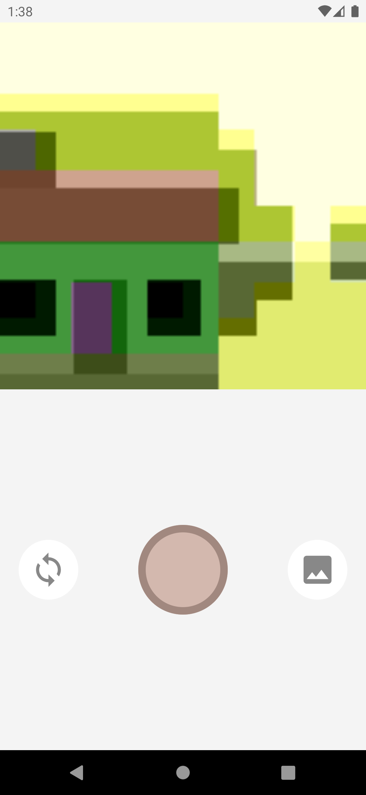
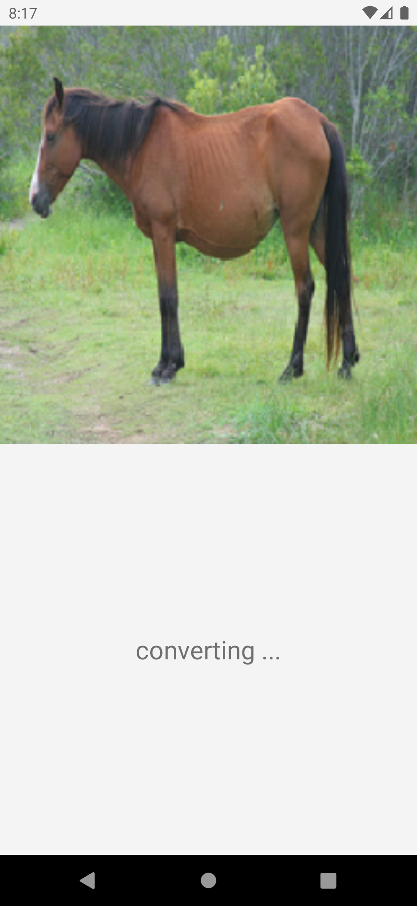
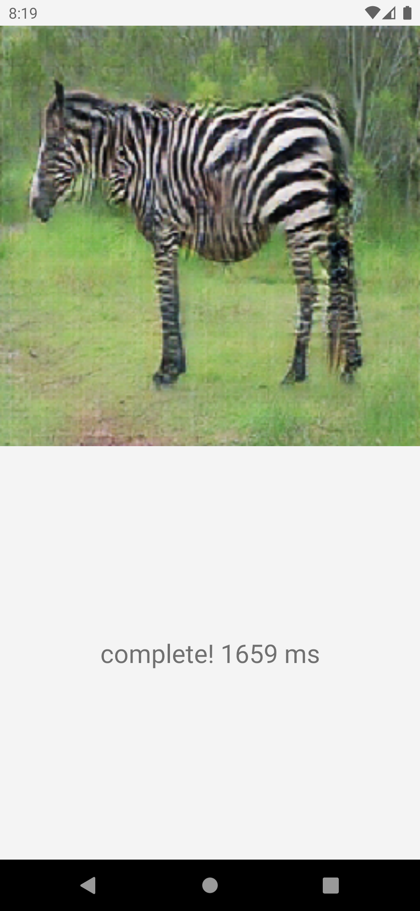

# camerax-pytorch-tflite
The simple android app for trying CameraX and PyTorch Mobile or TensorFlow Lite inference

## Screenshots
<div style="display: flex;">
  
  
  
</div>

## Getting Started
This app requires a pre-trained model supporting mobile devices of PyTorch or TensorFlow.

Available input shapes of each ML Library are as follows:
  - PyTorch - (N, H, W, C)
  - TensorFlow - (N, C, H, W)

The [sample pre-trained model](app/src/main/ml) is contained already (only TensorFlow).

### Instructions
1. Clone this project to your local environment.
2. Open [MLModule.kt](app/src/main/java/com/doryan/cameratf/di/MLModule.kt) and comment out either one PyTorch or TensorFlow.  
If you want to use TensorFlow, the code is like below.
```kt MLModule
fun provideMLImageConverter(
        @ApplicationContext context: Context
    ): MLImageConverter =
        // comment out either one you want to use
        MLImageConverterTF(context)
//        MLImageConverterPytorch(context)
}
```

The following 3rd and 4th steps differ depending on a ML Library selected.
#### PyTorch
3. Create Assets Folder and put your model there.  
Click on `File`, then `New` > `Folder` > `Assets Folder`.
4. Modify the model path in [MLImageConverterPytorch.kt](app/src/main/java/com/doryan/cameratf/interactor/MLImageConverterPytorch.kt).
```kt MLImageConverterPytorch
// private const val MODEL_PATH = "GANModel.ptl"
private const val MODEL_PATH = "MyModel.ptl"
```
#### TensorFlow
If you would like to use the sample model contained in the project already, skip these steps and take the 5th step.

3. Import your TensorFlow Lite Model.    
Click on `File`, then `New` > `Other` > `TensorFlow Lite Model`.
4. Modify the code that instantiating an imported model in [MLImageConverterTF.kt](app/src/main/java/com/doryan/cameratf/interactor/MLImageConverterTF.kt).
```kt MLImageConverterTF
// private val model = LiteModelEsrganTf21.newInstance(context, option)
private val model =  "MyModel.newInstance(context, option)"
```

---
5. Open [GlobalConfig.kt](app/src/main/java/com/doryan/cameratf/GlobalConfig.kt), modify each number of pixels in the height and the width of an input image.
6. Run the app.
